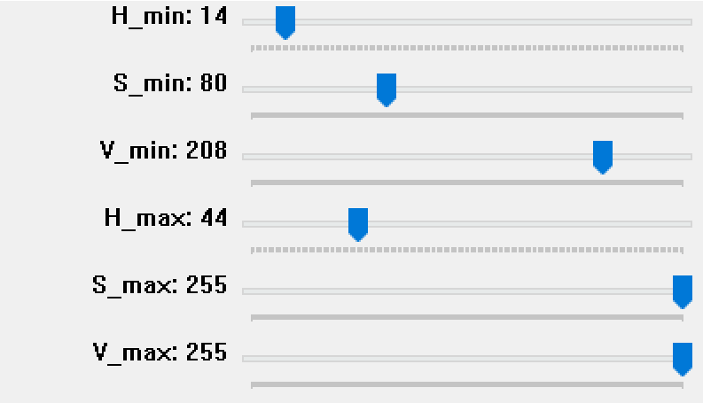
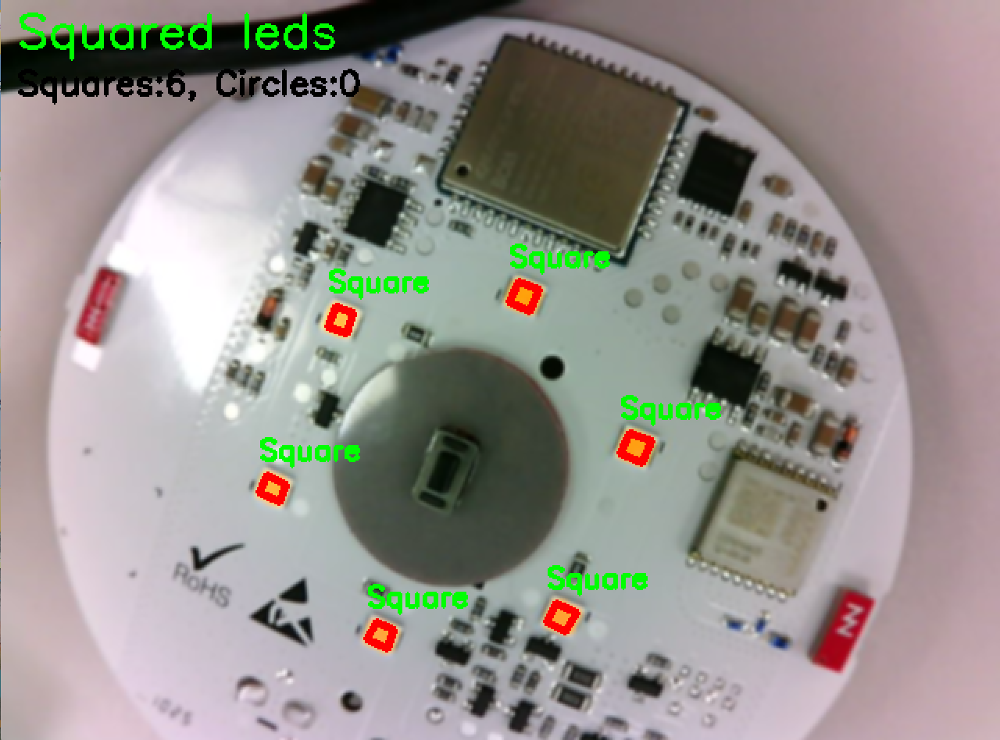
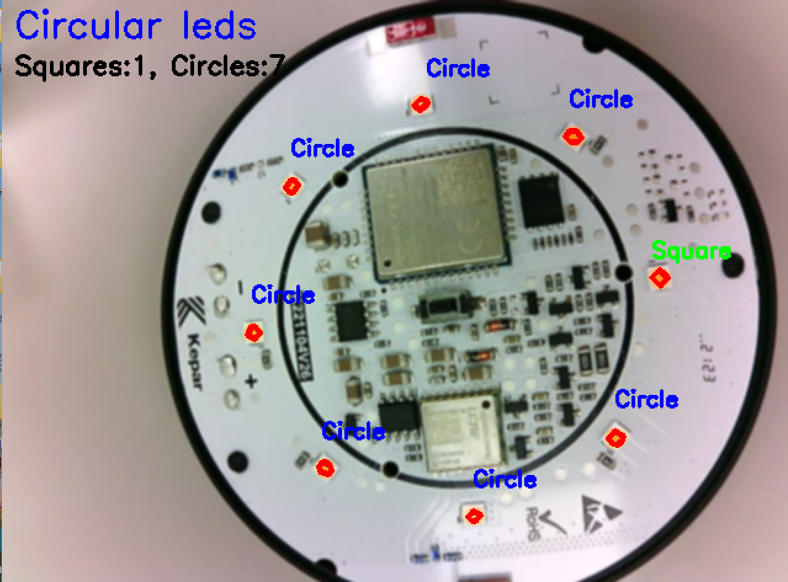
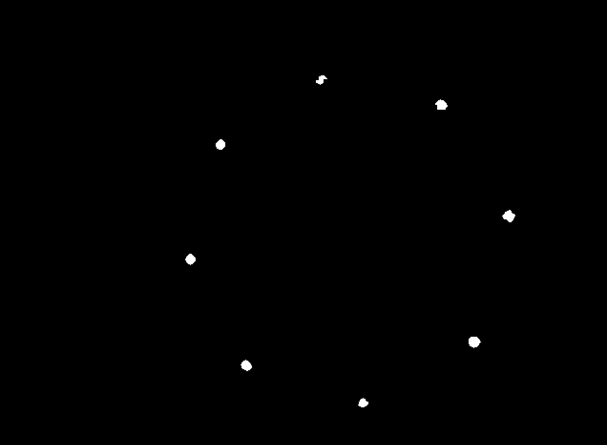

# Real-Time Shape Detection with OpenCV

A computer vision project that detects and classifies geometric shapes (squares and circles) in real-time using OpenCV and Python. The system uses HSV color filtering and contour analysis to identify shapes and provides live counting feedback.

## 🎯 Features

- **Real-time shape detection** from webcam feed
- **HSV color filtering** with adjustable trackbars
- **Geometric classification** (squares vs circles)
- **Live counting** and comparison display
- **Noise reduction** and image stabilization
- **Robust contour detection** with morphological operations

## 📋 Requirements

```bash
pip install opencv-python numpy
```

## 🚀 Quick Start

1. Clone the repository
2. Connect your webcam
3. Run the script:
```bash
python shape_detector.py
```
4. Adjust HSV trackbars to fine-tune color detection
5. Press `ESC` to exit

## 🛠️ Technical Implementation

### Core OpenCV Functions Explained

#### **1. Video Capture & Preprocessing**
```python
cap = cv2.VideoCapture(2)
frame = cv2.GaussianBlur(frame, (5, 5), 0)
```
- **VideoCapture(2)**: Accesses the third camera device (adjust index as needed)
- **GaussianBlur()**: Reduces noise and lighting variations for more stable detection

#### **2. Color Space Conversion**
```python
hsv = cv2.cvtColor(frame, cv2.COLOR_BGR2HSV)
```
- **HSV color space**: More robust than RGB for color-based object detection
- Better handles lighting variations and shadows

#### **3. HSV Trackbars for Dynamic Filtering**
```python
cv2.createTrackbar("H_min", "HSV", 14, 179, nothing)
cv2.createTrackbar("S_min", "HSV", 80, 255, nothing)
cv2.createTrackbar("V_min", "HSV", 208, 255, nothing)
```
- **Interactive adjustment**: Real-time tuning of color detection parameters
- **H (Hue)**: Color type (0-179)
- **S (Saturation)**: Color intensity (0-255)
- **V (Value)**: Brightness (0-255)

#### **4. Color Masking**
```python
mask = cv2.inRange(hsv, lower_bound, upper_bound)
```
- **Binary mask creation**: Isolates pixels within specified HSV range
- White pixels = target color, Black pixels = background

#### **5. Morphological Operations**
```python
mask = cv2.morphologyEx(mask, cv2.MORPH_CLOSE, kernel)  # Fill gaps
mask = cv2.morphologyEx(mask, cv2.MORPH_OPEN, kernel)   # Remove noise
mask = cv2.erode(mask, kernel)                          # Shrink objects
```
- **MORPH_CLOSE**: Fills small holes inside detected objects
- **MORPH_OPEN**: Removes small noise points
- **Erode**: Reduces object size to eliminate edge irregularities

#### **6. Contour Detection**
```python
contours, _ = cv2.findContours(mask, cv2.RETR_EXTERNAL, cv2.CHAIN_APPROX_SIMPLE)
```
- **RETR_EXTERNAL**: Only finds outermost contours (ignores holes)
- **CHAIN_APPROX_SIMPLE**: Compresses contours by removing redundant points

#### **7. Shape Classification**
```python
approx = cv2.approxPolyDP(cnt, 0.04 * cv2.arcLength(cnt, True), True)
```
- **Polygon approximation**: Simplifies contour to key vertices
- **Epsilon = 4%**: Balance between accuracy and stability
- **4 vertices = Square/Rectangle**
- **More vertices = Circle/Complex shape**

#### **8. Contour Drawing & Text Display**
```python
cv2.drawContours(frame, [approx], 0, (0, 0, 255), 3)
cv2.putText(frame, "Square", (x, y-10), cv2.FONT_HERSHEY_SIMPLEX, 0.6, (0, 255, 0), 2)
```
- **Visual feedback**: Highlights detected shapes with colored borders
- **Classification labels**: Real-time shape identification

## 🎮 Controls

| Control | Function |
|---------|----------|
| **H_min/H_max** | Adjust hue range (color type) |
| **S_min/S_max** | Adjust saturation range (color intensity) |
| **V_min/V_max** | Adjust value range (brightness) |
| **ESC Key** | Exit application |

## 📊 Algorithm Flow

1. **Capture** → Read frame from webcam
2. **Blur** → Apply Gaussian filter for noise reduction
3. **Convert** → Transform BGR to HSV color space
4. **Filter** → Create binary mask using HSV thresholds
5. **Clean** → Apply morphological operations
6. **Detect** → Find contours in processed mask
7. **Classify** → Analyze vertices to determine shape type
8. **Display** → Show results with counts and labels

## 🔧 Customization

### Adjust Detection Sensitivity
```python
# More stable detection (less sensitive)
approx = cv2.approxPolyDP(cnt, 0.06 * cv2.arcLength(cnt, True), True)

# More precise detection (more sensitive)  
approx = cv2.approxPolyDP(cnt, 0.02 * cv2.arcLength(cnt, True), True)
```

### Change Camera Source
```python
cap = cv2.VideoCapture(0)  # Default camera
cap = cv2.VideoCapture(1)  # External USB camera
```

### Modify Frame Rate
```python
key = cv2.waitKey(30)   # ~33 FPS
key = cv2.waitKey(100)  # ~10 FPS (more stable)
```

## 🖼️ Project Images


<p><em>Interactive HSV adjustment interface</em></p>

<table>
<tr>
<td></td>
<td></td>
</tr>
<tr>
<td colspan="2" align="center"><em>Detection of squared LEDs regardless of position</em></td>
</tr>
</table>

<table>
<tr>
<td></td>
<td></td>
</tr>
<tr>
<td colspan="2" align="center"><em>Detection of circular LEDs regardless of position</em></td>
</tr>
</table>

## 🎯 Applications

- **Quality Control**: Automated shape inspection in manufacturing
- **Educational Tool**: Computer vision learning and demonstration
- **Prototype Testing**: LED arrangement analysis and counting
- **Object Sorting**: Automated classification systems

## ⚡ Performance Tips

- **Lighting**: Use consistent, bright lighting for best results
- **Background**: Plain, contrasting backgrounds improve detection
- **Camera Position**: Stable mounting reduces motion blur
- **HSV Tuning**: Start with wide ranges, then narrow for precision

## 🤝 Contributing

Feel free to submit issues, fork the repository, and create pull requests for improvements.

## 📝 License

This project is open source and available under the [MIT License](LICENSE).
