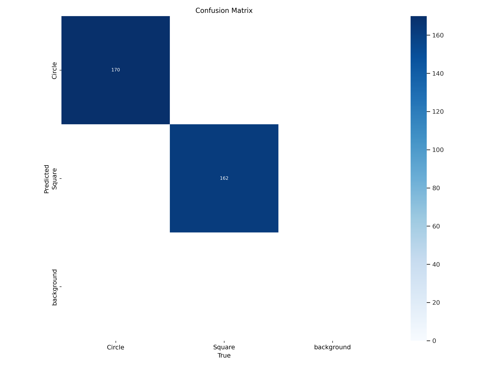
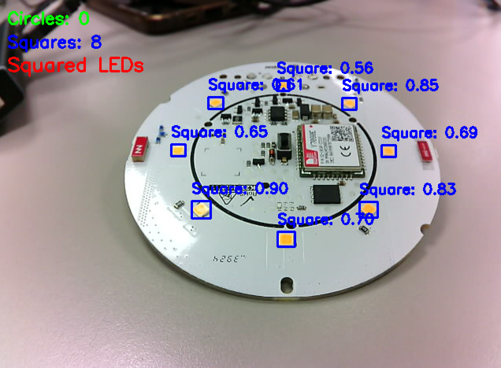
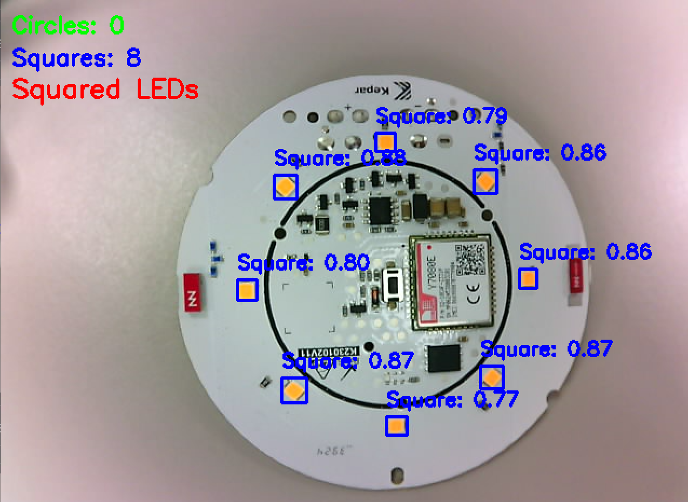
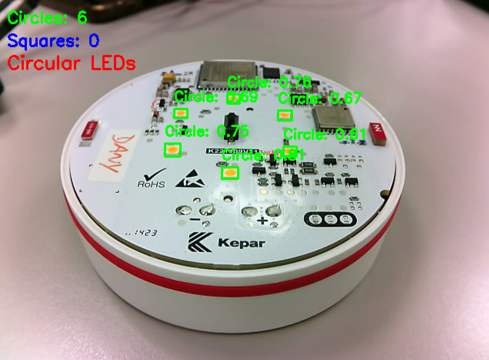

[Click aqui para ver el documento en Español](es_README.md)  
[Clickez ici pour lire le document traduit au français](fr_README.md)

> Note: This project was developed for a specific industrial application involving LED detection. The code serves as an educational example of OpenCV shape detection techniques and may require parameter adjustments for different use cases.

<table>
<tr>
<td></td>
<td></td>
</tr>
<tr>
<td colspan="2" align="center"><em>Types of led to detect</em></td>
</tr>
</table>

# Index:
### - [OpenCV detection](#real-time-shape-detection-with-opencv)
### - [YOLOv11 detection](#real-time-shape-detection-with-yolov11)

# Real-Time Shape Detection with OpenCV

A computer vision project that detects and classifies geometric shapes (squares and circles) in real-time using OpenCV and Python. The system uses HSV color filtering and contour analysis to identify shapes and provides live counting feedback.

## Features

- **Real-time shape detection** from camera feed
- **HSV color filtering** with adjustable trackbars
- **Geometric classification** (squares vs circles)
- **Live counting** and comparison display
- **Noise reduction** and image stabilization

## Requirements

```bash
pip install opencv-python numpy
```

## Usage

1. Connect your camera (RGB 5MP USB camera recommended)
2. Run ```OpenCV.py``` and adjust HSV trackbars to fine-tune color detection
3. Press `ESC` to exit

*Note: This project was developed for specific LED detection in an industrial setting. Parameters may need adjustment for different objects or lighting conditions.*

## Technical Implementation

### Core OpenCV Functions Explained

#### **1. Video Capture & Preprocessing**
```python
cap = cv2.VideoCapture(2)
frame = cv2.GaussianBlur(frame, (5, 5), 0)
```
- **VideoCapture(2)**: Accesses camera device (adjust index as needed)
- **GaussianBlur()**: Reduces noise and lighting variations for stable detection

#### **2. Color Space Conversion**
```python
hsv = cv2.cvtColor(frame, cv2.COLOR_BGR2HSV)
```
- **HSV color space**: More robust than RGB for color-based detection
- Better handles lighting variations

#### **3. HSV Trackbars for Dynamic Filtering**
```python
cv2.createTrackbar("H_min", "HSV", 14, 179, nothing)
cv2.createTrackbar("S_min", "HSV", 80, 255, nothing)
cv2.createTrackbar("V_min", "HSV", 208, 255, nothing)
```
- **Interactive adjustment**: Real-time tuning of color detection parameters
- **H (Hue)**: Color type (0-179)
- **S (Saturation)**: Color intensity (0-255)
- **V (Value)**: Brightness (0-255)

#### **4. Color Masking**
```python
mask = cv2.inRange(hsv, lower_bound, upper_bound)
```
- **Binary mask creation**: Isolates pixels within specified HSV range
- White pixels = target color, Black pixels = background

#### **5. Morphological Operations**
```python
mask = cv2.morphologyEx(mask, cv2.MORPH_CLOSE, kernel)  # Fill gaps
mask = cv2.morphologyEx(mask, cv2.MORPH_OPEN, kernel)   # Remove noise
mask = cv2.erode(mask, kernel)                          # Shrink objects
```
- **MORPH_CLOSE**: Fills small holes inside detected objects
- **MORPH_OPEN**: Removes small noise points
- **Erode**: Reduces object size to eliminate edge irregularities

#### **6. Contour Detection**
```python
contours, _ = cv2.findContours(mask, cv2.RETR_EXTERNAL, cv2.CHAIN_APPROX_SIMPLE)
```
- **RETR_EXTERNAL**: Only finds outermost contours (ignores holes)
- **CHAIN_APPROX_SIMPLE**: Compresses contours by removing redundant points

#### **7. Shape Classification**
```python
approx = cv2.approxPolyDP(cnt, 0.04 * cv2.arcLength(cnt, True), True)
```
- **Polygon approximation**: Simplifies contour to key vertices
- **Epsilon = 4%**: Balance between accuracy and stability
- **4 vertices = Square/Rectangle**
- **More vertices = Circle/Other shapes**

#### **8. Contour Drawing & Text Display**
```python
cv2.drawContours(frame, [approx], 0, (0, 0, 255), 3)
cv2.putText(frame, "Square", (x, y-10), cv2.FONT_HERSHEY_SIMPLEX, 0.6, (0, 255, 0), 2)
```
- **Visual feedback**: Highlights detected shapes with colored borders
- **Classification labels**: Real-time shape identification

## Controls

| Control | Function |
|---------|----------|
| **H_min/H_max** | Adjust hue range (color type) |
| **S_min/S_max** | Adjust saturation range (color intensity) |
| **V_min/V_max** | Adjust value range (brightness) |
| **ESC Key** | Exit application |

## Algorithm Flow

1. **Capture** → Read frame from webcam
2. **Blur** → Apply Gaussian filter for noise reduction
3. **Convert** → Transform BGR to HSV color space
4. **Filter** → Create binary mask using HSV thresholds
5. **Clean** → Apply morphological operations
6. **Detect** → Find contours in processed mask
7. **Classify** → Analyze vertices to determine shape type
8. **Display** → Show results with counts and labels

## Project Results

<table>
<tr>
<td></td>
</tr>
<tr>
<td colspan="2" align="center"><em>Interactive HSV adjustment interface</em></td>
</tr>
</table>

<table>
<tr>
<td></td>
<td></td>
</tr>
<tr>
<td colspan="2" align="center"><em>Detection of squared LEDs regardless of position</em></td>
</tr>
</table>

<table>
<tr>
<td></td>
<td></td>
</tr>
<tr>
<td colspan="2" align="center"><em>Detection of circular LEDs regardless of position</em></td>
</tr>
</table>


# Real-Time Shape Detection with YOLOv11

A deep learning approach for detecting and classifying geometric shapes (squares and circles) in real-time using YOLOv11 and custom-trained models. This implementation provides superior accuracy and robustness compared to traditional computer vision methods.  
Labeling was done with [Roboflow.com](https://roboflow.com/), a platform that simplifies dataset management, annotation, preprocessing, and training for computer vision tasks such as object detection, classification, and image segmentation. It allows users to create custom datasets and train models easily—even without prior machine learning experience.  
This model was trained with an NVIDIA RTX 3070 (8GB VRAM) using [RunPod.io](https://www.runpod.io/), a cloud computing platform that provides on-demand, affordable GPU instances for machine learning, AI training, inference, and other compute-intensive tasks. 

> ⚠️ **Warning**  
> At least a 4 Megapixels RGB camera is recomended to obtain decent results


## Features

- **Custom YOLOv11 model** trained specifically for LED shape detection
- **Real-time inference** with GPU acceleration support
- **High accuracy detection** (99.5% mAP50)
- **Live counting and classification** with instant feedback
- **Robust to lighting variations** and viewing angles

## Requirements

```bash
pip install -r required.txt
```
## Usage
### Run real-time detection:
1. Go to "Releases" division on this repository and download [YOLOv11_Model](https://github.com/IsmaTIBU/LedType_detection/releases/tag/Yolo11_Model) and load it on the same directory as detect.py
2. Execute ``` detect.py ```

## Model Training
### The YOLOv11 model was trained on a custom dataset containing:

- 247 training images (176 train, 48 validation, 23 test)
- ≈1175 labeled instances (circles and squares)
- 35 epochs with early stopping
- Batch size: 8 for optimal performance

### Training Results
| Metric | Value | Description | 
|--------|-------|-------------|
| **mAP50** | 99.5% | Mean Average Precision at 50% IoU |  
| **mAP50-95** | 76.7% | Mean Average Precision (50-95% IoU) |  
| **Precision** | 99.9% | Accuracy of positive predictions |  
| **Recall** | 100% | Ability to find all positive instances |  

### Training Progress

<table>
<tr>
<td></td>
<td></td>
</tr>
<tr>
<td colspan="2" align="center"><em>Labeling</em></td>
</tr>
</table>

<table>
<tr>
<td></td>
<td></td>
</tr>
<tr>
<td colspan="2" align="center"><em>Confusion matrices (Unnormalized/Normalized)</em></td>
</tr>
</table>

<table>
<tr>
<td></td>
<td></td>
<td></td>
</tr>
<tr>
<td colspan="3" align="center"><em>Confidance curves (Precission/Precission-Recall/Recall)</em></td>
</tr>
</table>

<table>
<tr>
<td></td>
<td></td>
</tr>
<tr>
<td></td>
<td></td>
</tr>
<tr>
<td colspan="2" align="center"><em>Squares: Correct LED detection is achieved even with up to 60° camera-to-board tilt.</em></td>
</tr>
</table>

<table>
<tr>
<td></td>
<td></td>
</tr>
<tr>
<td></td>
<td></td>
</tr>
<tr>
<td colspan="2" align="center"><em>Circles: Correct LED detection is achieved even with up to 70°-75° camera-to-board tilt.</em></td>
</tr>
</table>

## Conclusion: 
While both the OpenCV-based detection and the YOLOv11 model perform reasonably well, there is a notable difference in their versatility across varying real-world conditions.  
The YOLOv11 model consistently outperforms the OpenCV approach—not only in detection accuracy but especially in its robustness across diverse setups. I tested both methods using several cameras (varying in megapixel count and color saturation) and under different lighting conditions. In all scenarios, the YOLOv11 model demonstrated superior adaptability and more reliable LED detection, regardless of the camera or lighting variability.
