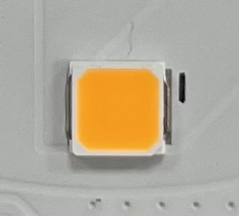

# Detección de Formas en Tiempo Real con OpenCV

Un proyecto de visión por computador que detecta y clasifica formas geométricas (cuadrados y círculos) en tiempo real usando OpenCV y Python. El sistema utiliza filtrado de color HSV y análisis de contornos para identificar formas y proporcionar retroalimentación de conteo en vivo.

<table>
<tr>
<td></td>
<td></td>
</tr>
<tr>
<td colspan="2" align="center"><em>Tipos de LEDs a detectar</em></td>
</tr>
</table>

## Características

- **Detección de formas en tiempo real** desde la alimentación de cámara
- **Filtrado de color HSV** con barras de seguimiento ajustables
- **Clasificación geométrica** (cuadrados vs círculos)
- **Conteo en vivo** y visualización comparativa
- **Reducción de ruido** y estabilización de imagen

## Requisitos

```bash
pip install opencv-python numpy
```

## Uso

1. Conecta tu cámara (se recomienda cámara USB RGB de 5MP)
2. Ejecuta el script y ajusta las barras de seguimiento HSV para afinar la detección de color
3. Presiona `ESC` para salir

*Nota: Este proyecto fue desarrollado para detección específica de LEDs en un entorno industrial. Los parámetros pueden necesitar ajustes para diferentes objetos o condiciones de iluminación.*

## Implementación Técnica

### Funciones Principales de OpenCV Explicadas

#### **1. Captura de Video y Preprocesamiento**
```python
cap = cv2.VideoCapture(2)
frame = cv2.GaussianBlur(frame, (5, 5), 0)
```
- **VideoCapture(2)**: Accede al dispositivo de cámara (ajustar índice según necesidad)
- **GaussianBlur()**: Reduce el ruido y variaciones de iluminación para detección estable

#### **2. Conversión de Espacio de Color**
```python
hsv = cv2.cvtColor(frame, cv2.COLOR_BGR2HSV)
```
- **Espacio de color HSV**: Más robusto que RGB para detección basada en color
- Maneja mejor las variaciones de iluminación

#### **3. Barras de Seguimiento HSV para Filtrado Dinámico**
```python
cv2.createTrackbar("H_min", "HSV", 14, 179, nothing)
cv2.createTrackbar("S_min", "HSV", 80, 255, nothing)
cv2.createTrackbar("V_min", "HSV", 208, 255, nothing)
```
- **Ajuste interactivo**: Sintonización en tiempo real de parámetros de detección de color
- **H (Matiz)**: Tipo de color (0-179)
- **S (Saturación)**: Intensidad del color (0-255)
- **V (Valor)**: Brillo (0-255)

#### **4. Enmascaramiento de Color**
```python
mask = cv2.inRange(hsv, lower_bound, upper_bound)
```
- **Creación de máscara binaria**: Aísla píxeles dentro del rango HSV especificado
- Píxeles blancos = color objetivo, Píxeles negros = fondo

#### **5. Operaciones Morfológicas**
```python
mask = cv2.morphologyEx(mask, cv2.MORPH_CLOSE, kernel)  # Rellenar huecos
mask = cv2.morphologyEx(mask, cv2.MORPH_OPEN, kernel)   # Eliminar ruido
mask = cv2.erode(mask, kernel)                          # Reducir objetos
```
- **MORPH_CLOSE**: Rellena pequeños agujeros dentro de objetos detectados
- **MORPH_OPEN**: Elimina pequeños puntos de ruido
- **Erode**: Reduce el tamaño del objeto para eliminar irregularidades de borde

#### **6. Detección de Contornos**
```python
contours, _ = cv2.findContours(mask, cv2.RETR_EXTERNAL, cv2.CHAIN_APPROX_SIMPLE)
```
- **RETR_EXTERNAL**: Solo encuentra contornos exteriores (ignora agujeros)
- **CHAIN_APPROX_SIMPLE**: Comprime contornos eliminando puntos redundantes

#### **7. Clasificación de Formas**
```python
approx = cv2.approxPolyDP(cnt, 0.04 * cv2.arcLength(cnt, True), True)
```
- **Aproximación poligonal**: Simplifica el contorno a vértices clave
- **Epsilon = 4%**: Equilibrio entre precisión y estabilidad
- **4 vértices = Cuadrado/Rectángulo**
- **Más vértices = Círculo/Otras formas**

#### **8. Dibujo de Contornos y Visualización de Texto**
```python
cv2.drawContours(frame, [approx], 0, (0, 0, 255), 3)
cv2.putText(frame, "Square", (x, y-10), cv2.FONT_HERSHEY_SIMPLEX, 0.6, (0, 255, 0), 2)
```
- **Retroalimentación visual**: Resalta formas detectadas con bordes coloreados
- **Etiquetas de clasificación**: Identificación de formas en tiempo real

## Controles

| Control | Función |
|---------|----------|
| **H_min/H_max** | Ajustar rango de matiz (tipo de color) |
| **S_min/S_max** | Ajustar rango de saturación (intensidad del color) |
| **V_min/V_max** | Ajustar rango de valor (brillo) |
| **Tecla ESC** | Salir de la aplicación |

## Flujo del Algoritmo

1. **Capturar** → Leer frame de la cámara web
2. **Difuminar** → Aplicar filtro Gaussiano para reducción de ruido
3. **Convertir** → Transformar BGR a espacio de color HSV
4. **Filtrar** → Crear máscara binaria usando umbrales HSV
5. **Limpiar** → Aplicar operaciones morfológicas
6. **Detectar** → Encontrar contornos en máscara procesada
7. **Clasificar** → Analizar vértices para determinar tipo de forma
8. **Mostrar** → Mostrar resultados con conteos y etiquetas

## Resultados del Proyecto

<table>
<tr>
<td></td>
</tr>
<tr>
<td colspan="2" align="center"><em>Interfaz interactiva de ajuste HSV</em></td>
</tr>
</table>

<table>
<tr>
<td></td>
<td></td>
</tr>
<tr>
<td colspan="2" align="center"><em>Detección de LEDs cuadrados independientemente de la posición</em></td>
</tr>
</table>

<table>
<tr>
<td></td>
<td></td>
</tr>
<tr>
<td colspan="2" align="center"><em>Detección de LEDs circulares independientemente de la posición</em></td>
</tr>
</table>

## Nota

Este proyecto fue desarrollado para una aplicación industrial específica que involucra detección de LEDs. El código sirve como ejemplo educativo de técnicas de detección de formas con OpenCV y puede requerir ajustes de parámetros para diferentes casos de uso.
