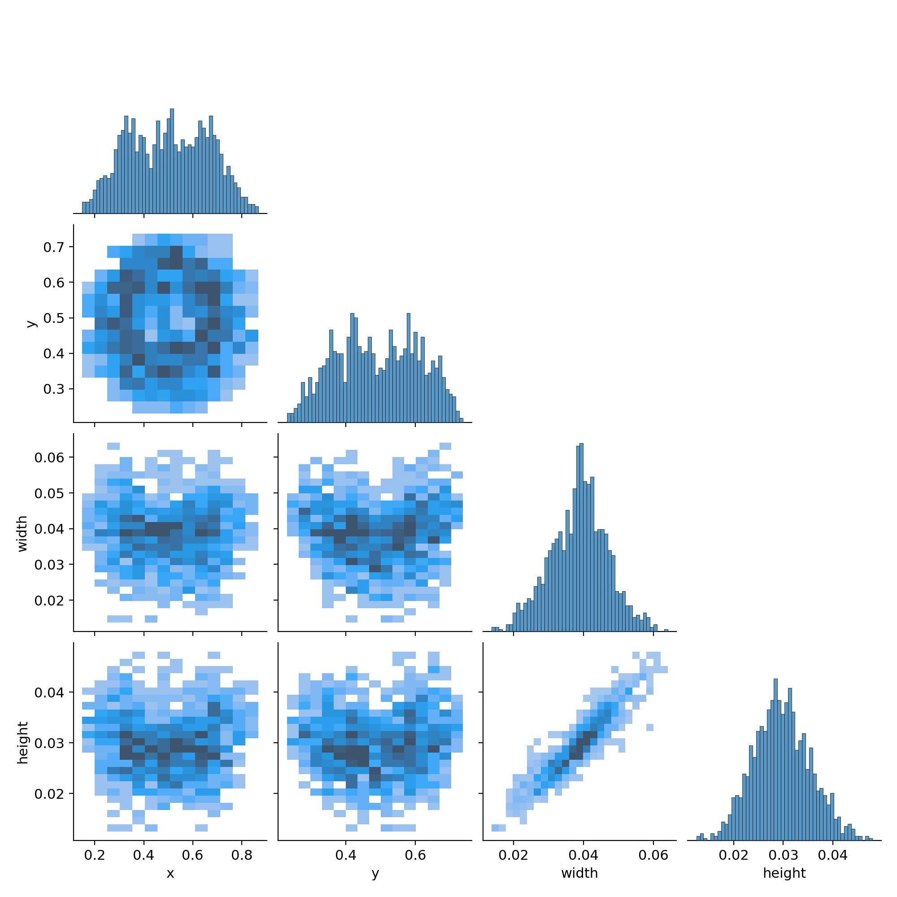
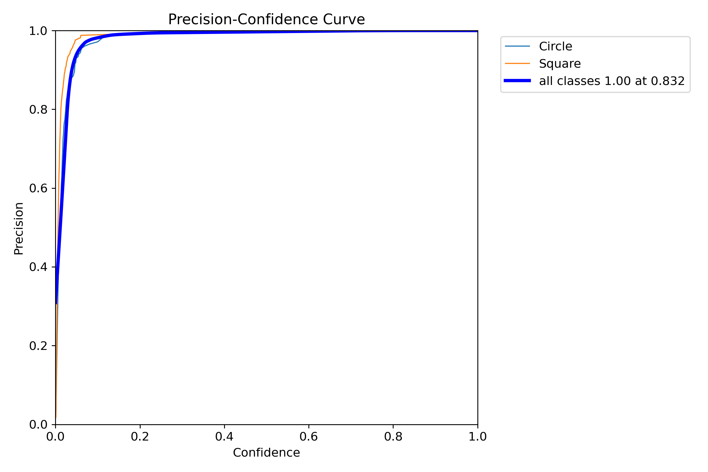
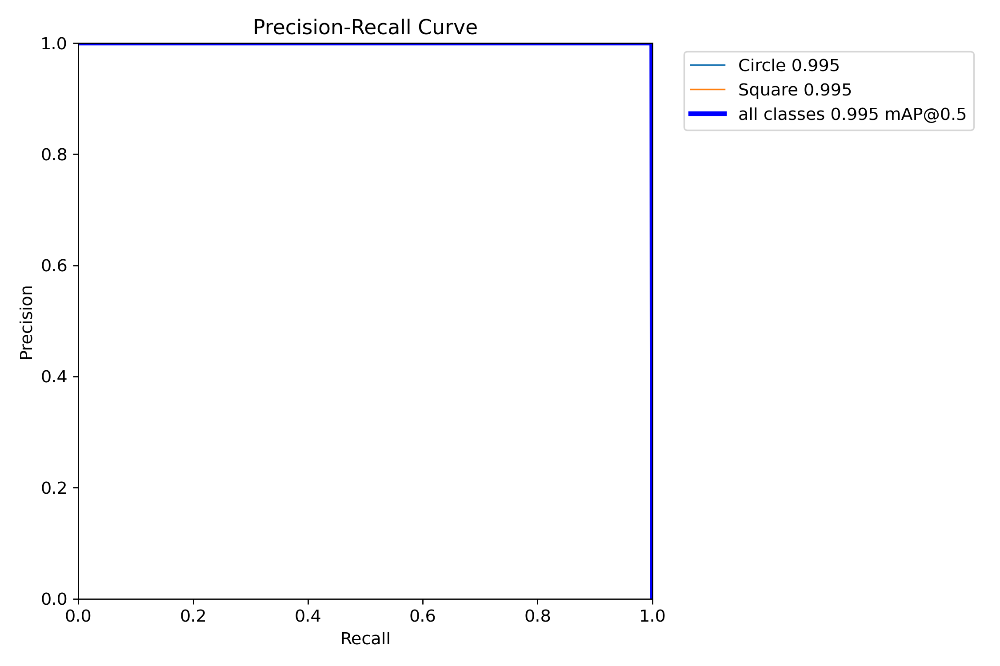
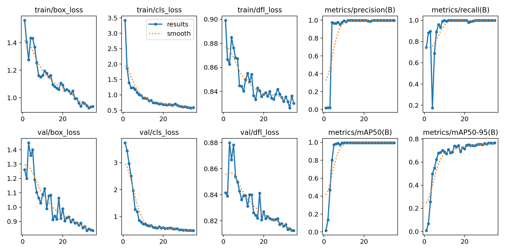
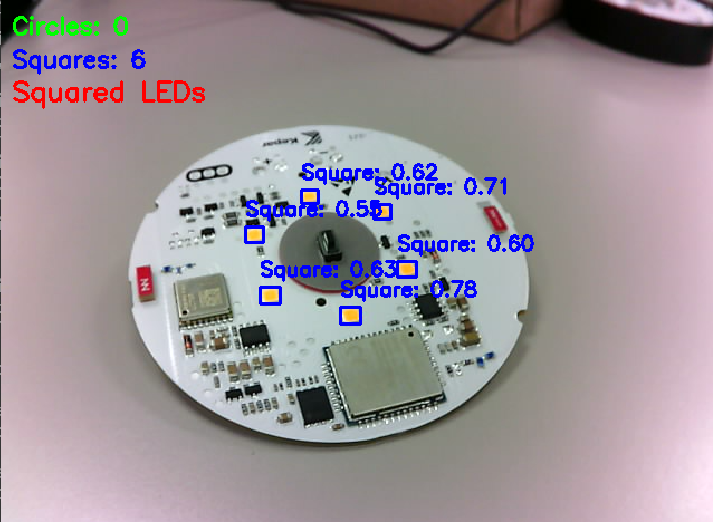
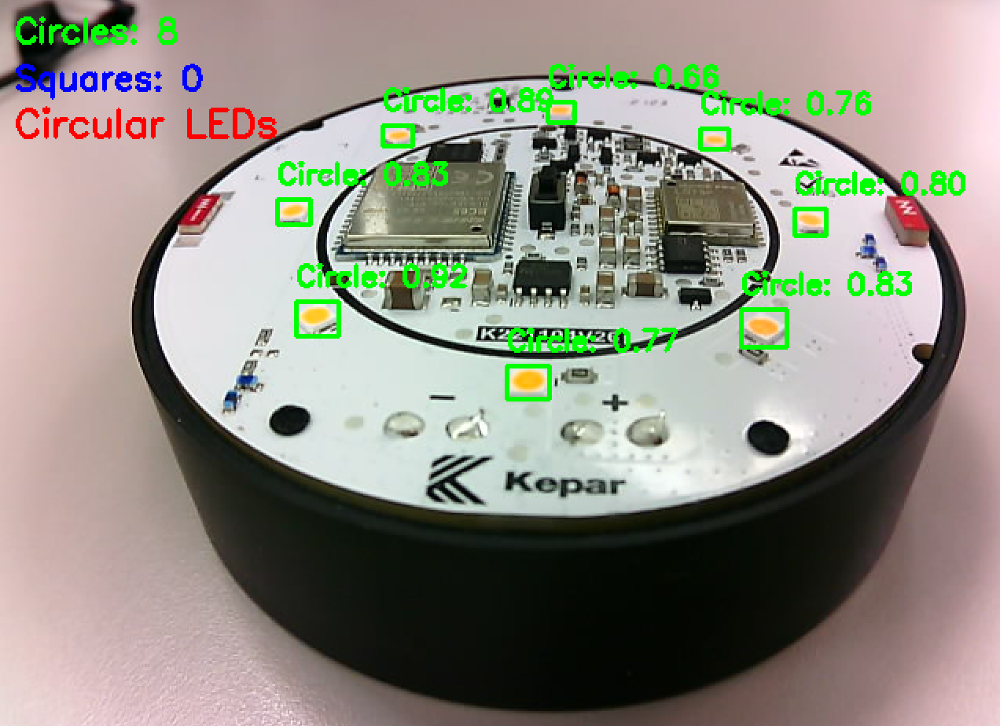
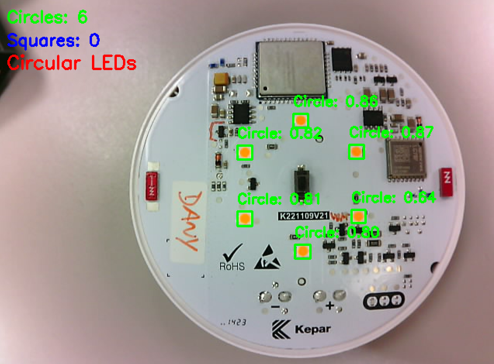

> [!Note]
> Ce projet a été développé pour une application industrielle spécifique impliquant la détection de LED. Le code sert d'exemple éducatif des techniques de détection de formes OpenCV et peut nécessiter des ajustements de paramètres pour différents cas d'usage.

<table>
<tr>
<td></td>
<td></td>
</tr>
<tr>
<td colspan="2" align="center"><em>Types de LED à détecter</em></td>
</tr>
</table>

# Indice:
### - [Détection avec  OpenCV](#détection-de-formes-en-temps-réel-avec-opencv)
### - [Détection avec YOLOv11](#détection-de-formes-en-temps-réel-avec-yolov11)

# Détection de Formes en Temps Réel avec OpenCV

Un projet de vision par ordinateur qui détecte et classe les formes géométriques (carrés et cercles) en temps réel en utilisant OpenCV et Python. Le système utilise le filtrage de couleur HSV et l'analyse de contours pour identifier les formes et fournit un retour de comptage en direct.

## Fonctionnalités

- **Détection de formes en temps réel** depuis le flux de caméra
- **Filtrage de couleur HSV** avec barres de défilement ajustables
- **Classification géométrique** (carrés vs cercles)
- **Comptage en direct** et affichage comparatif
- **Réduction de bruit** et stabilisation d'image

## Prérequis

```bash
pip install opencv-python numpy
```

## Utilisation

1. Connectez votre caméra (caméra USB RGB 5MP recommandée)
2. Exécutez ```OpenCV.py``` et ajustez les barres de défilement HSV pour affiner la détection de couleur
3. Appuyez sur `ESC` pour quitter

*Note : Ce projet a été développé pour la détection spécifique de LED dans un environnement industriel. Les paramètres peuvent nécessiter des ajustements pour différents objets ou conditions d'éclairage.*

## Implémentation Technique

### Fonctions OpenCV Principales Expliquées

#### **1. Capture Vidéo et Prétraitement**
```python
cap = cv2.VideoCapture(2)
frame = cv2.GaussianBlur(frame, (5, 5), 0)
```
- **VideoCapture(2)** : Accède au périphérique de caméra (ajuster l'index si nécessaire)
- **GaussianBlur()** : Réduit le bruit et les variations d'éclairage pour une détection stable

#### **2. Conversion d'Espace de Couleur**
```python
hsv = cv2.cvtColor(frame, cv2.COLOR_BGR2HSV)
```
- **Espace de couleur HSV** : Plus robuste que RGB pour la détection basée sur la couleur
- Gère mieux les variations d'éclairage

#### **3. Barres de Défilement HSV pour Filtrage Dynamique**
```python
cv2.createTrackbar("H_min", "HSV", 14, 179, nothing)
cv2.createTrackbar("S_min", "HSV", 80, 255, nothing)
cv2.createTrackbar("V_min", "HSV", 208, 255, nothing)
```
- **Ajustement interactif** : Réglage en temps réel des paramètres de détection de couleur
- **H (Teinte)** : Type de couleur (0-179)
- **S (Saturation)** : Intensité de couleur (0-255)
- **V (Valeur)** : Luminosité (0-255)

#### **4. Masquage de Couleur**
```python
mask = cv2.inRange(hsv, lower_bound, upper_bound)
```
- **Création de masque binaire** : Isole les pixels dans la plage HSV spécifiée
- Pixels blancs = couleur cible, Pixels noirs = arrière-plan

#### **5. Opérations Morphologiques**
```python
mask = cv2.morphologyEx(mask, cv2.MORPH_CLOSE, kernel)  # Combler les lacunes
mask = cv2.morphologyEx(mask, cv2.MORPH_OPEN, kernel)   # Supprimer le bruit
mask = cv2.erode(mask, kernel)                          # Réduire les objets
```
- **MORPH_CLOSE** : Remplit les petits trous à l'intérieur des objets détectés
- **MORPH_OPEN** : Supprime les petits points de bruit
- **Erode** : Réduit la taille des objets pour éliminer les irrégularités de bord

#### **6. Détection de Contours**
```python
contours, _ = cv2.findContours(mask, cv2.RETR_EXTERNAL, cv2.CHAIN_APPROX_SIMPLE)
```
- **RETR_EXTERNAL** : Ne trouve que les contours extérieurs (ignore les trous)
- **CHAIN_APPROX_SIMPLE** : Compresse les contours en supprimant les points redondants

#### **7. Classification de Formes**
```python
approx = cv2.approxPolyDP(cnt, 0.04 * cv2.arcLength(cnt, True), True)
```
- **Approximation polygonale** : Simplifie le contour aux sommets clés
- **Epsilon = 4%** : Équilibre entre précision et stabilité
- **4 sommets = Carré/Rectangle**
- **Plus de sommets = Cercle/Autres formes**

#### **8. Dessin de Contours et Affichage de Texte**
```python
cv2.drawContours(frame, [approx], 0, (0, 0, 255), 3)
cv2.putText(frame, "Square", (x, y-10), cv2.FONT_HERSHEY_SIMPLEX, 0.6, (0, 255, 0), 2)
```
- **Retour visuel** : Met en évidence les formes détectées avec des bordures colorées
- **Étiquettes de classification** : Identification de formes en temps réel

## Contrôles

| Contrôle | Fonction |
|----------|----------|
| **H_min/H_max** | Ajuster la plage de teinte (type de couleur) |
| **S_min/S_max** | Ajuster la plage de saturation (intensité de couleur) |
| **V_min/V_max** | Ajuster la plage de valeur (luminosité) |
| **Touche ESC** | Quitter l'application |

## Flux de l'Algorithme

1. **Capturer** → Lire l'image de la webcam
2. **Flouter** → Appliquer un filtre gaussien pour la réduction du bruit
3. **Convertir** → Transformer BGR vers l'espace de couleur HSV
4. **Filtrer** → Créer un masque binaire utilisant les seuils HSV
5. **Nettoyer** → Appliquer les opérations morphologiques
6. **Détecter** → Trouver les contours dans le masque traité
7. **Classifier** → Analyser les sommets pour déterminer le type de forme
8. **Afficher** → Montrer les résultats avec comptages et étiquettes

## Résultats du Projet

<table>
<tr>
<td></td>
</tr>
<tr>
<td colspan="2" align="center"><em>Interface d'ajustement HSV interactive</em></td>
</tr>
</table>

<table>
<tr>
<td></td>
<td></td>
</tr>
<tr>
<td colspan="2" align="center"><em>Détection de LED carrées indépendamment de la position</em></td>
</tr>
</table>

<table>
<tr>
<td></td>
<td></td>
</tr>
<tr>
<td colspan="2" align="center"><em>Détection de LED circulaires indépendamment de la position</em></td>
</tr>
</table>

# Détection de Formes en Temps Réel avec YOLOv11

Une approche d'apprentissage profond pour détecter et classifier les formes géométriques (carrés et cercles) en temps réel en utilisant YOLOv11 et des modèles entraînés personnalisés. Cette implémentation offre une précision et une robustesse supérieures par rapport aux méthodes traditionnelles de vision par ordinateur.  
L'étiquetage a été effectué avec [Roboflow.com](https://roboflow.com/), une plateforme qui simplifie la gestion des jeux de données, l'annotation, le prétraitement et l'entraînement pour les tâches de vision par ordinateur telles que la détection d'objets, la classification et la segmentation d'images. Elle permet aux utilisateurs de créer des jeux de données personnalisés et d'entraîner des modèles facilement—même sans expérience préalable en apprentissage automatique.  
Ce modèle a été entraîné avec une NVIDIA RTX 3070 (8GB VRAM) en utilisant [RunPod.io](https://www.runpod.io/), une plateforme de calcul en nuage qui fournit des instances GPU à la demande et abordables pour l'apprentissage automatique, l'entraînement IA, l'inférence et d'autres tâches computationnelles intensives.

> [!Warning]  
> Une camera RGB d'au moins 4 Megapixels est recommandée pour obtenir des résultats acceptables

## Caractéristiques

- **Modèle YOLOv11 personnalisé** entraîné spécifiquement pour la détection de formes de LED
- **Inférence en temps réel** avec support d'accélération GPU
- **Détection haute précision** (99.5% mAP50)
- **Comptage et classification en direct** avec retour instantané
- **Robuste aux variations d'éclairage** et aux angles de vue

## Exigences

```bash
pip install -r required.txt
```

## Utilisation
### Exécuter la détection en temps réel :
1. Allez dans la section "Releases" de ce dépôt et téléchargez [YOLOv11_Model](https://github.com/IsmaTIBU/LedType_detection/releases/tag/Yolo11_Model) et chargez-le dans le même répertoire que detect.py
2. Exécutez ```YOLO.py```

## Entraînement du Modèle
### Le modèle YOLOv11 a été entraîné sur un jeu de données personnalisé contenant :

- 102 images d'entraînement (81 entraînement, 21 validation, 10 test)
- ≈500 instances étiquetées (cercles et carrés)
- 20 époques avec arrêt précoce
- Taille de lot : 8 pour des performances optimales

### Résultats d'Entraînement
| Métrique | Valeur | Description |
|----------|--------|-------------|
| **mAP50** | 99,5% | Précision Moyenne Moyenne à 50% IoU |
| **mAP50-95** | 76.7% | Précision Moyenne Moyenne (50-95% IoU) |
| **Précision** | 99,9% | Précision des prédictions positives |
| **Rappel** | 100% | Capacité à trouver toutes les instances positives |

### Progression de l'Entraînement

<table>
<tr>
<td></td>
<td></td>
</tr>
<tr>
<td colspan="2" align="center"><em>Étiquetage</em></td>
</tr>
</table>

<table>
<tr>
<td></td>
<td></td>
</tr>
<tr>
<td colspan="2" align="center"><em>Matrices de confusion (Non normalisée/Normalisée)</em></td>
</tr>
</table>

<table>
<tr>
<td></td>
<td></td>
<td></td>
</tr>
<tr>
<td colspan="3" align="center"><em>Courbes de confiance (Précision/Précision-Rappel/Rappel)</em></td>
</tr>
</table>

<table>
<tr>
<td></td>
</tr>
<tr>
<td colspan="1" align="center"><em>Résultats globales de l'entrainement</em></td>
</tr>
</table>

<table>
<tr>
<td></td>
<td></td>
</tr>
<tr>
<td></td>
<td></td>
</tr>
<tr>
<td colspan="2" align="center"><em>Carrés : La détection LED correcte est atteinte même avec une inclinaison caméra-plaque de jusqu'à 60°.</em></td>
</tr>
</table>

<table>
<tr>
<td></td>
<td></td>
</tr>
<tr>
<td></td>
<td></td>
</tr>
<tr>
<td colspan="2" align="center"><em>Cercles : La détection LED correcte est atteinte même avec une inclinaison caméra-plaque de jusqu'à 70°-75°.</em></td>
</tr>
</table>

## Conclusion :
Bien que la détection basée sur OpenCV et le modèle YOLOv11 performent raisonnablement bien tous les deux, il existe une différence notable dans leur polyvalence à travers des conditions réelles variées.  
Le modèle YOLOv11 surpasse constamment l'approche OpenCV—non seulement en précision de détection mais surtout dans sa robustesse à travers des configurations diverses. J'ai testé les deux méthodes en utilisant plusieurs caméras (variant en nombre de mégapixels et en saturation des couleurs) et sous différentes conditions d'éclairage. Dans tous les scénarios, le modèle YOLOv11 a démontré une adaptabilité supérieure et une détection LED plus fiable, indépendamment de la variabilité de la caméra ou de l'éclairage.
